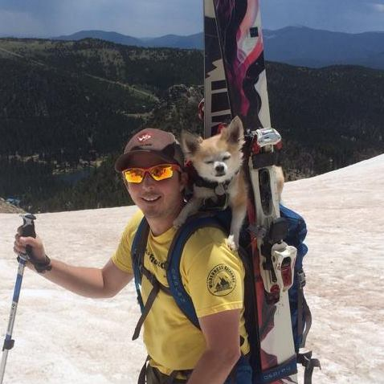

# Team In-Toke-A-Bola

Though I'm a team of one, I'm passionate about software development, engineering and just building fun and interesting tools and products.

# About the team
| Eric |
|--
|  |

# Motivation
I've joined this hackathon because I'm trying to bootstrap 2 companies in my time outside of my normal (full-time) day to day job.  Winning this competition could help me fund operational costs of these companies and build my own software company.  I'm passionate about my projects and I'd like to retire at 40.  Then I can enjoy the outdoors more often here in Colorado and focus on supporting various public-serving organizations by building tools and software for them.  Some of those organizations are: [CAIC](http://avalanche.state.co.us/about-us/),   [The Access Fund](http://www.accessfund.org/), [Friends of Berthoud Pass](http://berthoudpass.org/#sthash.FK69QPZG.dpbs), [Friends of Indian Creek](https://friendsofindiancreek.wordpress.com/mission/), ...

# Skills / Concept
I'm skilled in development using a number of different technologies: Java, Ruby on Rails, Angular JS, etc.,  to name a few.

I've seen a number of different HTML5 / Angular Games out there, and that might be what I go for.  I do live in Colorado, so building an app for the Medical Marijuana Industry is not off the table.
