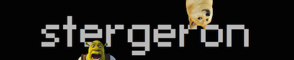

#Team Stergeron

No regrets, ever.

#About

We're a bunch of high schoolers from Massachusetts, wanting to make a better world in computers.

#Team

###William Tan
 > William, senior in high school, has been coding and using GNU and Linux for 6 years. Some people call him insane for using GNU and Linux exclusively, taping his webcams, password protecting his hacked up calculator, and using Vim instead of an IDE. He is Head of Software Development for his First Tech Challenge Robotics team and also Head of Technology for his school's Physics Club. This year, he carried his team to 113th place out of the over 3000 teams competing in PicoCTF, a computer security challenge. He knows Python, Java, Lua, Javascript, C, Axe, and dabbles in dozens of other languages. He specializes in computer security, GNU and Linux, and networking. Although many people don’t know this and find it hard to believe, William swam for 6 years and dove for his high school swim team.

###Max Krieger

> Max has been doing web development for the past three years, both for fun and for some clients. His projects include [Tabmaster](https://chrome.google.com/webstore/detail/tabmaster/pojgemmobcnjmnpodjmgeofdgojpkepn), a Chrome extension to help better manage your tabs, and [seae](http://a9.io/Steam-Emoticon-Art-Editor/), a utility for people to create their own pixel art out of the emoticons they own on steam. He programs in full stack js, and has experience in other fields such as game design, UI/UX, graphic design, and photography. He is interested in AI, Control Systems, and eSports.  This is his first hackathon, and he is ready.

###Dianne Lee

> Dianne is a dreamer, a wisher, a reader, a writer, a soccer midfielder, a journalist, and a coder. As captain of her high school's math team and founder of the Needham Chapter of Girls Who Code Clubs, she is passionate about encouraging interest in STEM. She pursues journalism as editor in chief of her school newspaper and writing for her local paper, with a special interest in the increasing shift towards digital in the publication industry. Dianne's favorite languages are Latin and Python.

###Nick Hluska

> Nick is the team leader for Stergeron. He has competed in the American Computer Science League and attended the Blueprint Hackathon. His other STEM endeavours include being the President and founder of his high school’s Theoretical Physics Club and having collaborated with Fermi National Accelerator Laboratory scientists on experiments involving cosmic ray detection and analysis. He is a retired semi-professional Starcraft player, an active semi-professional Super Smash Brothers Melee Player, and a baseball player. His competitive hobbies outside of STEM, baseball, and eSports include chess, where he is the Co-Captain of the Needham High School Chess Team. He has experience with C++.
